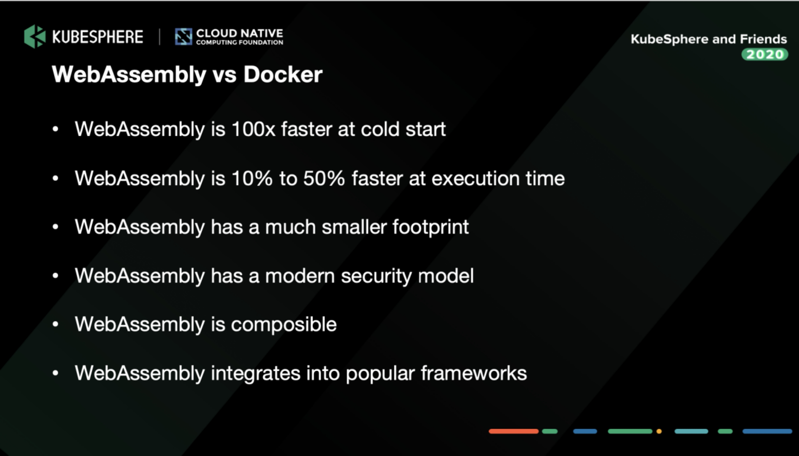

# Frequently Asked Questions

## How can I check if a language is supported?

Check the Fermyon list of ["WebAssembly Support in Top 20 Languages"](https://www.fermyon.com/wasm-languages/webassembly-language-support). Ensure that the "WASI" column has a green checkbox.

## Is Go Supported?

Go is not currently supported due to a lack of WebAssembly (WASI) support in the Go WASM implimentation as mentioned in the article [Evaluating new languages for Compute@Edge](https://www.fastly.com/blog/evaluating-new-languages-for-edge-compute). This is still the case as of May 2022.

>  Go WebAssembly does have good community documentation when targeting the web with Go WebAssembly, however stable support for compiling to the [WebAssembly System Interface (WASI)](https://wasi.dev/) is still an [open issue](https://github.com/golang/go/issues/31105) as of April, 2020.

That being said, `tinygo` may support building a Go SDK now. See more in the Enarx guide ["WebAssembly with Golang"](https://enarx.dev/docs/webassembly/golang) which uses the following command to create a WASI-supporting WASM binary:

`% tinygo build -wasm-abi=generic -target=wasi -o main.wasm main.go`

## How does WebAssembly compare with Docker?

WebAssembly has some advantages over Docker including:

See more in this article by [Will Cloud-Native WebAssembly Replace Docker? by Michael Yuan and Yicen Xie](
https://kubesphere.io/blogs/will-cloud-native-webassembly-replace-docker_/)
